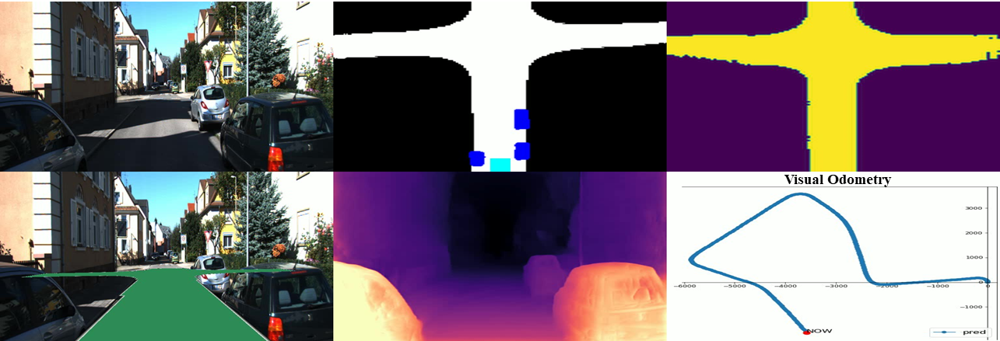
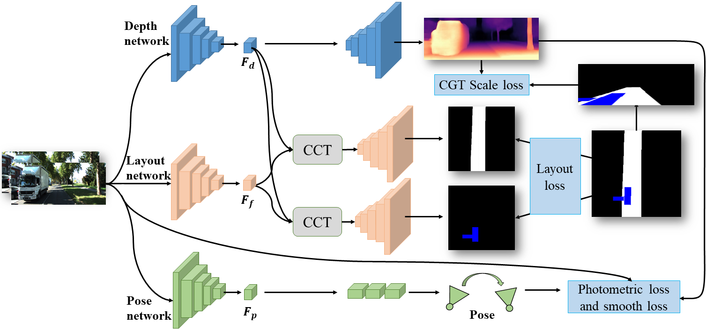
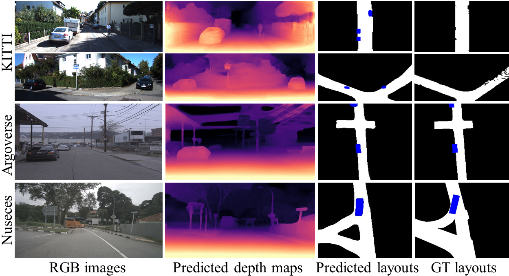

# JPerceiver: Joint Perception Network for Depth, Pose and Layout Estimation in Driving Scenes
#### Haimei Zhao, Jing Zhang, Sen Zhang and Dacheng Tao

#### Accepted to ECCV 2022



## Abstract

Depth estimation, visual odometry (VO), and bird's-eye-view (BEV) scene layout estimation present three critical tasks for driving scene perception, which is fundamental for motion planning and navigation in autonomous driving. Though they are complementary to each other, prior works usually focus on each individual task and rarely deal with all the three tasks together. A naive way is to accomplish them independently in a sequential or parallel manner, but there are three drawbacks, i.e., 1) the depth and VO results suffer afrom the inherent scale ambiguity issue; 2) the BEV layout is usually estimated separately for roads and vehicles, while the explicit overlay-underlay relations between them are ignored; and 3) the BEV layout is directly predicted from the front-view image without using any depth-related information, although the depth map contains useful geometry clues for inferring scene layouts. In this paper, we address these issues by proposing a novel joint perception framework named JPerceiver, which can estimate scale-aware depth and VO as well as BEV layout simultaneously from a monocular video sequence. It exploits the cross-view geometric transformation (CGT) to propagate the absolute scale from the road layout to depth and VO based on a carefully-designed scale loss. Meanwhile, a cross-view and cross-modal transfer (CCT) module is devised to leverage the depth clues for reasoning road and vehicle layout through an attention mechanism. JPerceiver can be trained in an end-to-end multi-task learning way, where the CGT scale loss and CCT module promote inter-task knowledge transfer to benefit feature learning of each task. Experiments on Argoverse, Nuscenes and KITTI show the superiority of JPerceiver over existing methods on all the above three tasks in terms of accuracy, model size, and inference speed.

## Contributions

* we propose the first joint perception framework JPerceiver for depth, VO and BEV layout estimation simultaneously; 
* we design a CGT scale loss to leverage the absolute scale information from the BEV layout to achieve scare-aware depth and VO; 
* we devise a CCT module that leverages the depth clues to help reason the spatial relationships between roads and vehicles implicitly, and facilitates the feature learning for BEV layout estimation;
* we conduct extensive experiments on public benchmarks and show that JPerceiver outperforms the state-of-the-art methods on the above three tasks by a large margin.
## Approach overview




More details can be found in the paper:
JPerceiver: Joint Perception Network for Depth, Pose and Layout Estimation in Driving Scenes (ECCV 2022) by Haimei Zhao, Jing Zhang, Sen Zhang and Dacheng Tao.

## Installation

We recommend setting up a Python 3.5+ and Pytorch 1.1+ Virtual Environment and installing all the dependencies listed in the requirements file.

```plain
git clone https://github.com/sunnyHelen/JPerceiver.git

cd JPerceiver
pip install -r requirements.txt
```
## Datasets
In the paper, we've presented results for KITTI 3D Object, KITTI Odometry, KITTI RAW, and Argoverse 3D Tracking v1.0 datasets. For comparison with [Schulter et. al.](https://cseweb.ucsd.edu/~mkchandraker/pdf/eccv18_occlusionreasoning.pdf?fileGuid=3X8QJDGGJPXyQgW9), We've used the same training and test splits sequences from the KITTI RAW dataset. For more details about the training/testing splits one can look at the `splits` directory. And you can download Ground-truth from [Monolayout](https://github.com/hbutsuak95/monolayout?fileGuid=3X8QJDGGJPXyQgW9).

```plain
# Download KITTI RAW
./data/download_datasets.sh raw

# Download KITTI 3D Object
./data/download_datasets.sh object

# Download KITTI Odometry
./data/download_datasets.sh odometry

# Download Argoverse Tracking v1.0
./data/download_datasets.sh argoverse
```
The above scripts will download, unzip and store the respective datasets in the `datasets` directory.
```plain
datasets/
└── argoverse                          # argoverse dataset
    └── argoverse-tracking
        └── train1
            └── 1d676737-4110-3f7e-bec0-0c90f74c248f
                ├── car_bev_gt         # Vehicle GT
                ├── road_gt            # Road GT
                ├── stereo_front_left  # RGB image
└── kitti                              # kitti dataset 
    └── object                         # kitti 3D Object dataset 
        └── training
            ├── image_2                # RGB image
            ├── vehicle_256            # Vehicle GT
    ├── odometry                       # kitti odometry dataset 
        └── 00
            ├── image_2                # RGB image
            ├── road_dense128  # Road GT
    ├── raw                            # kitti raw dataset 
        └── 2011_09_26
            └── 2011_09_26_drive_0001_sync
                ├── image_2            # RGB image
                ├── road_dense128      # Road GT
```
## Training

1. Prepare the corresponding dataset

2. Run training
```plain
# Training
CUDA_VISIBLE_DEVICES=0,1,2,3,4,5,6,7 python -m torch.distributed.launch --nproc_per_node=8 --master_port 25629  train.py --config config/cfg_kitti_baseline_odometry_boundary_ce_iou_1024_20.py --work_dir log/odometry/

```
3. Choose different config file and log directory for different datasets and training settings. 

4. The evaluation of BEV layout is conducted during training, which can be found in respective "xxx.log.json" files.

## Evaluation

1. Prepare the corresponding dataset
2. Download pre-trained models
3. Run evaluation
```plain
# Evaluate depth results 
python scripts/eval_depth_eigen.py 

# Evaluate VO results
python scripts/draw_odometry.py 

```

## Pretrained Models

The following table provides links to the [pre-trained models](https://drive.google.com/drive/u/0/folders/1QAUEluGvSimXsvtvpXE0FxMR7jCxm0BO) for each dataset mentioned in our paper. The table also shows the corresponding evaluation results for these models.


| Dataset            | Segmentation Objects | mIOU(%) | mAP(%) | Pretrained Model                                                                                                       | 
| :--------:           | :-----:     |:-------:|:------:| :----:                                                                                                                 |
| KITTI 3D Object     | Vehicle    |  40.85  | 57.23  | [link](https://drive.google.com/drive/u/0/folders/1QAUEluGvSimXsvtvpXE0FxMR7jCxm0BO) |
| KITTI Odometry     | Road     |  78.13  | 89.57  | [link](https://drive.google.com/drive/u/0/folders/1QAUEluGvSimXsvtvpXE0FxMR7jCxm0BO) |
| KITTI Raw          | Road     |  66.39  | 86.17  | [link](https://drive.google.com/drive/u/0/folders/1QAUEluGvSimXsvtvpXE0FxMR7jCxm0BO) |
| Argoverse Tracking | Vehicle    |  49.45  | 65.84  | [link](https://drive.google.com/drive/u/0/folders/1QAUEluGvSimXsvtvpXE0FxMR7jCxm0BO) |
| Argoverse Tracking | Road    |  77.50  | 90.21  | [link](https://drive.google.com/drive/u/0/folders/1QAUEluGvSimXsvtvpXE0FxMR7jCxm0BO) |

Results of depth estimation on eigen split

| abs_rel             | sq_rel | rmse | rmse_log |  a1  |   a2  | a3   |   Scaling ratios    | Pretrained Model                                                                                                       | 
| :--------:           | :-----:     |:-------:|:--------:|-----|-----|------|-----| :----:                                                                                                                 |
| 0.116      | 0.984   | 5.022|  0.193   | 0.875 | 0.959 | 0.982 | 1.074 ± 0.077  | [link](https://drive.google.com/drive/u/0/folders/1QAUEluGvSimXsvtvpXE0FxMR7jCxm0BO) |


## Results



## Visualize predictions


```plain
### Draw trajectories
python scripts/plot_kitti.py 

### Prediction video generation
# kitti
python eval_kitti_video.py

# Argoverse
eval_argo_both_video.py

#Nuscenes
eval_nuscenes_both.py
```

## Contact
If you meet any problems, please describe them in issues or contact:
* Haimei Zhao: [hzha7798@uni.sydney.edu.au](hzha7798@uni.sydney.edu.au)

## License
This project is released under the MIT License (refer to the LICENSE file for details).
Thanks for the open-source related works. This project partially depends on the sources of [Monolayout](https://github.com/hbutsuak95/monolayout), [PYVA](https://github.com/JonDoe-297/cross-view) and [FeatDepth](https://github.com/sconlyshootery/FeatDepth)
